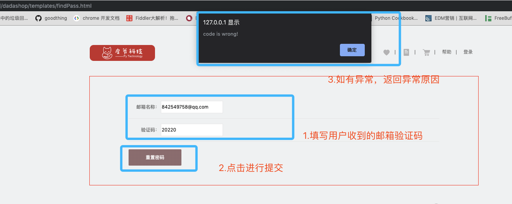
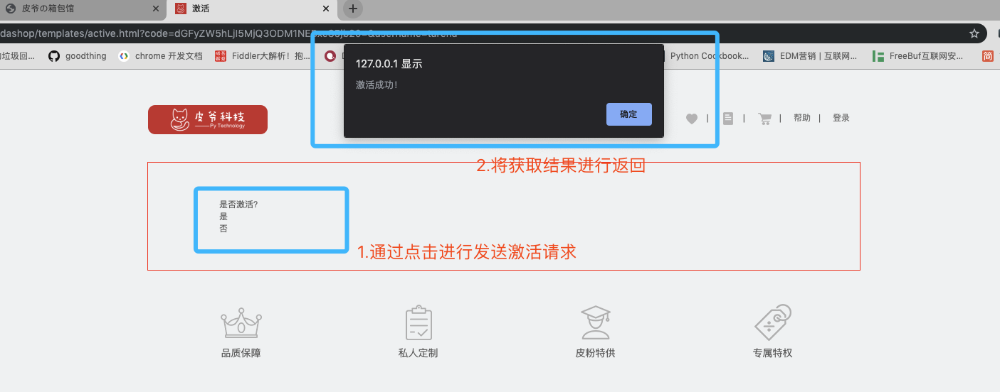

# 用户模块-接口说明

# 一.用户模块概述：	

​		用户模块主要提供对于是用户使用本产品的基础。用户模块提供以下功能：

>找回密码
>
>修改密码
>
>用户激活
>
>用户收获地址新增/修改/删除/设为默认
>

# 二.事件定义

## 找回密码

​		用户在登陆页可以通过点击找回密码按钮来实现找回密码功能，主要分为三步。首先通过用户发送注册时的邮箱，此时会向邮箱中发送一份关于找回密码的验证码，此验证码会有时效。通过输入对应的验证码，验证没问题之后，显示设置新密码界面，提交之后就可以使用新密码进行登录。

##修改密码

​		修改密码功能需要在登录情况下进行，在个人账号管理页面中选择，需要输入旧密码以及新密码。通过ajax进行与后端交互。如果用户正确修改密码之后，则需要重新登陆。

## 用户激活

​		用户在注册的同时会同步发送用户激活的邮件。此激活邮件中存在用户激活的链接，用户通过点击此链接之后，在此页面内进行跳转到激活页面，此页面中有两个按钮，是否激活。用户点击激活之后，通过ajax发送激活请求。进行激活。

##用户地址

​	地址查询功能：在用户访问到地址页面时，此时会发送用户绑定的地址请求，全量返回有效的用户地址。

​	增加地址功能：用户可以提交新增地址，包括收货人、收件地址、地址标签、以及用户的联系方式，通过ajax提交。如果正常存储的话，此时回全量返回用户绑定的地址。

​	修改地址功能：用户可以修改有效地址中的收件人、收件地址、练习方式、以及地址标签。提交成功的话，回全量返回用户的地址。

​	删除地址功能：用户可以在界面上触发删除地址按钮，此时会将地址的ID通过ajax传入到后台，通过设置该地址的活跃属性来实现删除功能，此功能也是全量返回，然后通过渲染进行在前端展示。

​	设为默认地址：用户可以将任意一个非默认地址改为默认地址。通过ajax提交到后端，此功能提交的是地址的ID，将此ID的地址设置为默认，同时将此用户的其他地址ID设为非默认。然后进行全量返回。进行渲染。

# 三.API 说明

## 修改密码

 在登录的状态下才能够修改用户登录密码。

#### 事件触发：

页面名： **personal_password.html**


#### 触发结果：

​	触发成功：


​	触发失败：


修改密码API：

**URL**: `http://127.0.0.1:8000/v1/users/<username>/password`

**请求方法**：POST

**请求参数**：JSON

| 字段        | 含义     | 类型 | 备注 |
| ----------- | -------- | ---- | ---- |
| oldpassword | 旧密码   | char | 必填 |
| password1   | 新密码   | char | 必填 |
| password2   | 确认密码 | char | 必填 |

请求示例：

```json
{
  'oldpasword':'123456',
  'password1':'123321',
  'password2':'654321'
}
```

| 字段    | 含义                                     | 类型 | 备注                      |
| ------- | ---------------------------------------- | ---- | ------------------------- |
| code    | 状态                                     | int  | 默认正常为200。异常见附录 |
| error   | 错误信息                                 | dict | 与data二选一              |
| data    | 正确信息                                 | dict | 与error二选一             |
| message | 包含在正确信息或者错误信息中，为具体原因 | char | 存在于data或者error中     |

**返回值**：JSON

**响应格式**：

```json
# 正确示例
{
  'code':200,
  'data':'修改成功'
}
# 错误示例
{
  'code':xxx,
  'error':'error reason'
}
```

#### 

## 找回密码功能

**时序图**


###step1 发送邮箱验证请求：

#### 事件触发：

页面名： **findPass.html**


#### 触发结果：

邮箱中可以收到后台发送的邮箱验证码（10分钟之内有效）：


触发失败：


发送邮箱验证

**URL**：`http://127.0.0.1:8000/v1/users/password/sms`

**请求方法**：POST

**请求参数**：JSON

| 字段  | 含义 | 类型 | 备注             |
| ----- | ---- | ---- | ---------------- |
| email | 邮箱 | char | 通过邮箱找回密码 |

请求示例：

```json
{
	'email':xxxxx # 邮箱
}
```

响应数据

| 字段  | 含义         | 类型 | 备注          |
| ----- | ------------ | ---- | ------------- |
| code  | 状态吗       | int  | 必填          |
| data  | 返回数据     | dict | 与error二选一 |
| error | 返回错误原因 | char | 与data二选一  |

**返回值**：JSON

**响应格式**：

```json
# 正常响应
{
  'code':200,
  'data':"邮件发送成功",
}
# 异常响应
{
  'code':xxx,
  'error':'error reason'
}
```


### step2: 发送邮箱验证码

#### 事件触发：

页面名： **findPass.html**


#### 触发结果：

正常结果：


异常结果：




发送邮箱验证码：

**URL**：`http://127.0.01:8000/v1/users/password/verification/`

**请求方法**： POST

**请求参数**：JSON

| 字段  | 含义   | 类型 | 备注 |
| ----- | ------ | ---- | ---- |
| email | 邮箱   | char | 必填 |
| code  | 验证码 | char | 必填 |

```json
{
  'email':'xxxx',
  'code':'xxxx'
}
```

响应数据：

| 字段  | 含义           | 类型 | 备注          |
| ----- | -------------- | ---- | ------------- |
| code  | 响应状态吗     | char | 必填          |
| data  | 返回正常数据() | dict | 与error二选一 |
| error | 返回错误原因() | char | 与data二选一  |

**返回值**：JSON

**响应格式**：

```json
# 正常响应
{
  'code':200,
 	'data':'验证码通过'，
  'email’：‘xxxx’ # 返回邮箱
}
# 异常响应
{
  'code':xxx,
  'error':'error reason'
}
```

### step3 修改密码

#### 事件触发：

页面名： **findPass.html**


#### 触发结果：

正常响应


异常响应：


修改密码：

**URL**：`http://127.0.0.1:8000/v1/users/password/new`

**请求方法**：POST

**请求参数**：JSON

| 字段      | 含义     | 类型 | 备注 |
| --------- | -------- | ---- | ---- |
| email     | 邮箱     | char | 必填 |
| password1 | 新密码   | char | 必填 |
| Password2 | 确认密码 | char | 必填 |

请求i示例

```json
{
	"email":"xxx",    # 通过用户邮箱锁定用户
  'password1':'xxx' # 新密码
  'password2':'xxx' # 确认密码
}
```

响应数据：

| 字段    | 含义         | 类型 | 备注             |
| ------- | ------------ | ---- | ---------------- |
| code    | 响应状态码   | char | 必填             |
| data    | 返回正常数据 | dict | 与error二选一    |
| error   | 返回异常数据 | dict | 与data二选一     |
| message | 具体响应信息 | char | 正确或者错误原因 |

**返回值**：JSON

**响应格式**：

```json
# 正常数据
{
  'code':200,
  'data':'OK'
}
#  异常数据
{
  'code':xxx,
  'error':'error reason'
}
```


## 邮箱验证激活功能

​		在用户注册时候，后台会给用户注册填写的邮箱发送一条激活的链接。通过点击链接跳转到达达商城的用户激活页面。通过激活来实现商城所有功能的体验。

#### 事件触发：

用户在注册时候会通过邮箱给用户发送一封激活邮件，然后用户通过点击链接，进行重定向到前端地址，此时通过js获取用户前端页面的查询字符串，进行激活。

页面名： **register.html**


#### 触发结果：

正常结果：


 跳转激活页面：

页面地址： **xxx/xxx/active.html**



异常结果：


**URL**：`http://127.0.0.1:8000/v1/users/activation?code=xxxx`

**请求方法**：GET

**请求参数**：JSON

| 字段 | 含义                           | 类型 | 备注 |
| ---- | ------------------------------ | ---- | ---- |
| code | 用户名和随机码base64编码字符串 | char | 必填 |

**返回值**：JSON

**响应格式**：

```json
# 正常响应
{
  'code': 200,
  'data': '激活成功'
}
# 异常响应
{
  'code':xxx,
  'error':'error_reason'
}
```


## 地址功能-增删改查设为默认

达达商城提供地址增删改查设为默认的功能：

​	查询功能：在用户请求的地址管理页面的时候，等页面主体加载完之后，会发送查询当前用户的绑定地址。返回当前用户绑定的所有地址。

​	增加地址功能：用户可以新增绑定地址。

​	修改地址功能：可以修改用户地址中的任何字段。

​	删除地址功能：可以删除用户所绑定的地址，不是真正的删除，而是在后台将地址改为非活跃的。

​	设为默认地址：用户可以将任意一个非默认地址改为默认地址。默认地址在用户完成付款之前会直接绑定到该订单上。


#### 地址增删改查接口


### 查询地址：

**URL**:`http://127.0.0.1:8000/v1/users/<username>/address`

#### 事件触发：

页面名：**addressAdmin.html**


#### 触发结果：

​	正常响应：


​	异常响应：

​	如果用户没有登陆的访问到地址页面，此时会弹出用户登陆提示，然后跳到登陆页面。


**请求方法**：GET

返回数据：在访问页面的时候，返回当前用户的所有地址

**返回值**：JSON

**响应格式**：

```json
# 正常数据返回
{
  "code":200,
   "addresslist":[
      {
        'id':123456, # 地址id
        'address':'广东省深圳市龙华区嘉熙业广场1155室'， # 地址
        'receiver’：’达内科技‘， # 收货人
        'receiver_mobile‘：'12345678901', # 联系电话
        'tag':'家'，# 地址标签
        'postcode':'722494',  #
        'is_default':"True",
      },
      {
         'id':123457,
        'address':'广东省深圳市龙华区嘉熙业广场1142室'，
        'receiver’：’达内科技‘，
        'receiver_mobile‘：'12345678910',
        'tag':'公司'，
        'postcode':'722406',
        'is_default':"False",
      }
    ]
}
# 异常数据返回类型：
{
  'code': status_code,
  'error':'error_reason'
}
```


### 新增地址：

#### 事件触发：


#### 触发结果：

​	正常结果：


​    异常结果：


**URL**:`http://127.0.0.1:8000/v1/users/<username>/address`

**请求方法**：POST

**请求参数**：JSON

| 参数           | 参数类型  | 含义       | 备注 |
| -------------- | --------- | ---------- | ---- |
| receiver       | char(10)  | 收件人     | 必填 |
| receiver_phone | char(11)  | 收件人电话 | 必填 |
| address        | char(100) | 地址       | 必填 |
| postcode       | char(7)   | 邮编       | 必填 |
| tag            | char(10)  | 标签       | 必填 |

请求示例

```json
{
  'receiver':'小王'，
  ‘receiver_phone’:'18667018590',
  'address':'北京市东城区珠市口大街珍贝大厦2楼',
  'postcode':'722405',
  'tag':'公司'
}
```

**返回值**：JSON

**响应格式**：

```json
# 正常响应
{
  "code":200,
  "data":"新增地址成功！"
}
# 异常响应
{
  'code': status_code,
  'error':'error_reason'
}
```

### 删除地址

#### 事件触发：

页面名：**addressAdmin.html**


#### 触发结果：

正常触发:


**URL**:`http://127.0.0.1:8000/v1/users/<username>address/<id>`

**请求方法**：DELETE

**请求参数**: JSON

| 参数     | 参数类型 | 含义   | 备注 |
| -------- | -------- | ------ | ---- |
| id       | char(10) | 地址ID | 必填 |
| username | char(11) | 用户名 | 必填 |

```json
{
  'id':'xxxxxx'
}
```

**返回值**：JSON

**响应格式**：

```json
# 正常响应
{
  "code":200,
   "data":"删除地址成功"
}
# 异常响应：
{
  'code':xxxx,
  'error':'error_reason'
}
```


### 修改地址：

#### 事件触发：

页面名：**addressAdmin.html**


#### 触发结果：

正常响应


异常响应


**URL**:`http://127.0.0.1:8000/v1/users/<username>/address/<id>`

**请求方式**：PUT

**请求参数**：JSON

| 参数           | 参数类型  | 含义       | 备注 |
| -------------- | --------- | ---------- | ---- |
| tag            | char(10)  | 地址标签   | 必填 |
| receiver_phone | char(11)  | 收件人电话 | 必填 |
| receiver       | char(7)   | 收件人姓名 | 必填 |
| Address        | char(100) | 收件人地址 | 必填 |

请求示例：

```json
{
  'receiver':'校长',
  'receiver_phone':'18667018590'，
  'address':'广东省深圳市龙华区民治大道100号',
  'tag':'公司',
}
```

**返回值**：JSON

**响应格式**：

```json
# 正常响应
{
  "code":200,
  "data":"地址修改成功！"
}

# 异常响应
{
    "code": xxx,
     'error':'error_reason'
}
```

### 设为默认：

#### 事件触发：

页面名：**addressAdmin.html**


#### 触发结果：

正常触发


**URL**：`http://127.0.0.1:8000/v1/users/address/<username>/default`

请求类型：**POST**

| 参数 | 参数类型 | 含义   | 备注 |
| ---- | -------- | ------ | ---- |
| id   | char(10) | 地址ID | 必填 |

请求示例

```json
{
  'id':'xxxxxxx'
}
```

**返回值**：JSON

**响应格式**：

```json
# 正常响应
{
  "code":200,
  "data":"设为默认成功！"
}
# 异常响应
{
  'code':xxx,
  'error':'error_reason'
}
```

#### 

### 附录：用户模块异常状态码参考：

| 状态码 |          响应信息          |                       原因短语                        |
| :----: | :------------------------: | :---------------------------------------------------: |
|  200   |            正常            |                          OK                           |
| 10100  |          无效参数          |                  Invalid parameters                   |
| 10101  | 无法获取用户名，需要登陆。 |                  User not logged in                   |
| 10102  |  设置新密码两次输入不一致  |                Inconsistent passwords                 |
| 10103  |         旧密码错误         |                  Old password error                   |
| 10104  |        用户查询出错        |                   User query error                    |
| 10105  |       存储验证码失败       |          Storage authentication code failed           |
| 10106  |   验证码失效，请重新发送   | The validation code is invalid. Please send it again. |
| 10107  |     无法获取用户旧密码     |            Unable to retrieve old password            |
| 10108  |         无效的密码         |              Please enter your password               |
| 10109  |        确认密码有误        |        Confirm that the password is incorrect         |
| 10110  |       两次密码不一致       |               Password Inconsistencies                |
| 10111  |         旧密码错误         |                  Old password error!                  |
| 10112  |        验证链接失效        |     Verify that the link is invalid and resend it     |
| 10113  |      激活链接参数有误      |           Error activating link parameters            |
| 10114  |        地址查询出错        |                Error in Address Query                 |
| 10115  |        无效的收件人        |                  invalid recipients                   |
| 10116  |         无效的地址         |                    Invalid address                    |
| 10117  |       无效的电话号码       |                 Invalid phone number                  |
| 10118  |         无效的邮编         |                   Invalid postcode                    |
| 10119  |       无效的地址标签       |                     Invalid  tag                      |
| 10120  |        地址存储异常        |               Address storage exception               |
| 10121  |        地址查询异常        |                 Get address exception                 |
| 10122  |       无法获取地址ID       |                 Get address id error                  |
| 10123  |      修改地址参数有误      |       Error in address modification parameters        |
| 10124  |     无法获取微博登陆页     |               Cant get weibo login page               |
| 10125  |     无法获取微博token      |               Unable to get weibo token               |
| 10126  |         无效的邮箱         |                     Invalid email                     |
| 10127  |        无效的用户名        |                   Invalid username                    |
| 10128  |        创建用户失败        |                  Create user failed                   |
| 10129  |      无效的微博token       |                 Invalid access token                  |
| 10130  |        关联微博失败        |                Related to weibo failed                |
| 10131  |        无效的手机号        |                 Invalid phone number                  |
|  201   |   微博账号未绑定本地用户   |                   access_token used                   |
| 10131  |          重复请求          |                   Repeated requests                   |
| 10132  |       获取验证码异常       |                   Verify Code Error                   |
| 10133  |        新旧密码重复        |                Use Different Password                 |
| 10134  |        无法获取用户        |                    Can't get User                     |
